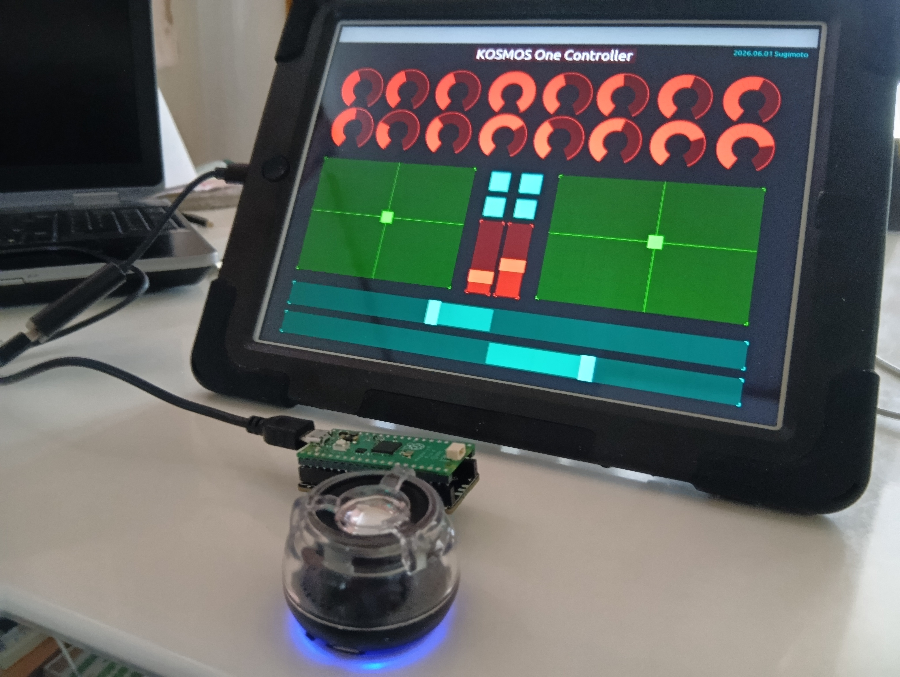

# 🌌 KOSMOS-ONE  
Generative Melodic Instrument for RP2040 + PRA32-U  
**Pimoroni Pico Audio Pack Edition — No Display / Headless Version**

KOSMOS-ONE is a standalone generative melodic instrument built on the  
Raspberry Pi Pico (RP2040), featuring a dual-instance PRA32-U synthesizer  
running entirely on Core1.  
This version is **exclusively designed for the Pimoroni Pico Audio Pack**  
and includes **no LCD or visual display of any kind**.

KOSMOS-ONE focuses on expressive, evolving sound generation using  
Japanese musical scales, breathing tempo variations, and organic randomness.

---

## ✨ Features

### 🎼 Japanese Scales Built In
KOSMOS-ONE includes three traditional Japanese scales:

- **Hirajoushi** (平調子)
- **Miyakobushi** (都節)
- **Insen** (陰旋法)

Switching scales regenerates rhythmic and melodic patterns,  
allowing the instrument to shift its emotional character instantly.

---

### 🎲 Organic Generative Engine
The generative system is designed to feel *alive*, not random.

It combines:

- Euclidean rhythm generation  
- Per-step probability  
- Scale-dependent density  
- Directional arpeggios  
- Tempo breathing  
- Controlled randomness  

The result is music that evolves naturally—  
**always different, yet always musical**.

---

### 🎛 Dual-Synth Architecture (PRA32-U × 2)
Core1 runs two independent PRA32-U synthesizers:

- **A-Part** — main melodic voice  
- **B-Part** — sub voice for drones, bass, or harmonic grounding  

The B-Part uses the lightweight sub-synth mode to fit within RP2040 memory,  
and its volume is controlled via an internal gain stage  
(CC82 → internal gain), ensuring smooth real-time control.

---

### 🎚 External MIDI & TouchOSC Control
KOSMOS-ONE responds to external MIDI CC messages:

| CC | Function |
|----|----------|
| CC20 | Density (note probability) |
| CC22 | Speed / BPM |
| CC81 | Scale select |
| CC82 | B-Part Volume (internal gain) |
| CC106 | Parameter save trigger |

TouchOSC layouts can be used to control the instrument like a hardware synth.

---

## 🖥 No Display / Headless Operation
This version of KOSMOS-ONE is **completely displayless**:

- **No LCD screen**  
- **No graphical UI**  
- **No SPI display hardware required**  

All interaction is done through:

- Physical buttons  
- External MIDI  
- TouchOSC  
- USB MIDI output  

This makes the device simpler, lighter, and more focused on sound generation.

---

## 🔧 Hardware Requirements

- Raspberry Pi Pico / Pico W  
- **Pimoroni Pico Audio Pack (required)**  
- Physical buttons / joystick (optional)  
- USB MIDI host (optional)

**Note:**  
This version **does not support Waveshare Pico-Audio**.  
The I2S pinout and DAC behavior are tuned specifically for the  
Pimoroni Pico Audio Pack.

---

## 🚀 Architecture Overview

### Core0
- Generative engine  
- MIDI input handling  
- Pattern generation  
- TouchOSC / USB MIDI bridge  

### Core1
- PRA32-U Synth A  
- PRA32-U Synth B (sub-synth mode)  
- I2S audio output (Pimoroni Audio Pack)  
- Internal MIDI event queue  

Memory usage is optimized to fit two synth engines  
within RP2040’s 264KB SRAM.

---

## 🎧 Sound Characteristics

- Japanese-inspired melodic motion  
- Breathing tempo and phrasing  
- Organic, evolving patterns  
- Deep sub textures from B-Part  
- Bright, expressive A-Part melodies  
- Harmonically coherent randomness  

KOSMOS-ONE is designed to feel like a living instrument.

---

## 📄 License

Open-source (MIT).  

---

KOSMOS-ONE aims to be a **self-playing musical companion**—  
a device that generates endless, expressive melodies  
shaped by your interaction and the subtle logic within.
