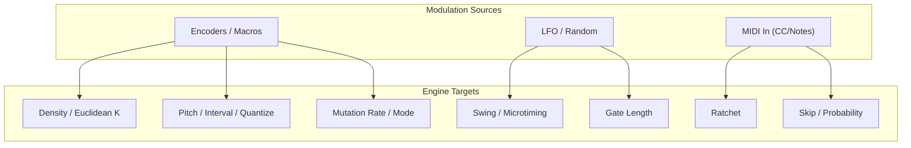

# Node Diagram (Signal & Responsibility Overview)
```mermaid
graph LR
  %% Layout: left-to-right
  %% === Nodes ===
  subgraph RP2040["RP2040 (KOSMOS)"]
    C0["Core0<br/>(Sequencer / UI / MIDI)"]
    C1["Core1<br/>(Audio / I2S streaming)"]
  end

  subgraph Buses[On-chip Buses & IO]
    I2S["I2S<br/>(BCLK / LRCK / DOUT)"]
    SPI["SPI<br/>(SCK / MOSI / DC / CS / RST / BL)"]
    GPIO["GPIO<br/>(Buttons / Encoders / LEDs)"]
  end

  subgraph Peripherals[Peripherals]
    LCD[Waveshare LCD]
    DAC["PCM5102<br/>(I2S DAC)"]
  end

  %% === Connections (logical/role-based) ===
  %% Cores to buses
  C0 -->|control / queueing| I2S
  C1 -->|audio samples out| I2S

  C0 -->|draw commands| SPI
  C0 -->|poll/interrupt| GPIO

  %% Buses to devices
  I2S -->|BCLK / LRCK / DOUT| DAC
  SPI -->|SCK / MOSI / DC / CS / RST / BL| LCD
  GPIO -->|inputs/outputs| LCD
  GPIO -->|status LED etc.| DAC

  %% Cross-core cooperation
  C0 <-.->|messages / ring buffer| C1
  ```

## 1) Generative Sequencer Dataflow 
```mermaid
graph LR
  %% Layout
  %% Core concept: clock/transport -> rule/probability engines -> event scheduler -> output

  subgraph Inputs[Inputs & Modulation]
    CLK["Clock<br/>(Internal / MIDI)"]
    UI["UI Controls<br/>(Encoders/Buttons/LCD)"]
    LFO[LFO / Random Walk]
    EXT["MIDI In (optional)"]
  end

  subgraph Theory[Musical Context]
    KEY[Key / Scale]
    HARM["Chord / Mode (optional)"]
  end

  subgraph Engines[Generative Engines]
    RYTHM["Rhythm Engine<br/>(Euclidean / Pattern / Density)"]
    PROB["Probability Rules<br/>(Note On, Tie, Ratchet, Skip)"]
    PITCH["Pitch Engine<br/>(Scale-Quantized, Intervals)"]
    VEL[Velocity / Accent Model]
    HUMA["Humanize<br/>(Microtiming / Swing)"]
    MUT["Mutation<br/>(Seeded, Step-wise / Bar-wise)"]
  end

  subgraph Sched[Scheduler]
    QUEUE["Event Queue<br/>(Ring Buffer)"]
    SCHED["Tick Scheduler<br/>(PPQN / DMA friendly)"]
  end

  subgraph Outputs[Outputs]
    MIDI["MIDI Out<br/>(USB / DIN)"]
    AUDIO["I2S Audio (PCM5102)<br/>(optional)"]
  end

  %% Wiring
  CLK --> SCHED
  UI --> Engines
  UI --> Theory
  LFO --> Engines
  EXT -->|Clock/Notes/CC| Engines

  Theory --> PITCH
  RYTHM --> PROB
  PROB --> PITCH
  PITCH --> VEL
  VEL --> HUMA
  MUT -.-> Engines

  %% Event emission into queue
  RYTHM --> QUEUE
  PROB --> QUEUE
  PITCH --> QUEUE
  VEL --> QUEUE
  HUMA --> QUEUE

  SCHED --> QUEUE
  QUEUE --> MIDI
  QUEUE --> AUDIO
  ```
## 2)  Timing & Scheduling (Core collaboration and queues)Generative Sequencer  Dataflow 
```mermaid
sequenceDiagram
  participant CLK as Clock (Internal/MIDI)
  participant SEQ as Sequencer Engine (Core0)
  participant Q as Event Queue (Ring Buffer)
  participant OUT as Output Driver
  participant C1 as Core1 (Audio/I2S, optional)

  Note over SEQ: Initialize seed, scale, rules, buffers
  CLK->>SEQ: tick (PPQN)
  SEQ->>SEQ: step evaluation (rhythm / prob / pitch / vel / humanize)
  SEQ->>Q: enqueue NoteOn/NoteOff with timestamps
  loop until queue empty or deadline
    OUT->>Q: pop due events
    Q-->>OUT: event (timed)
    alt MIDI build
      OUT->>OUT: send USB/DIN MIDI
    else Audio build
      OUT->>C1: push audio note/gate to I2S render
    end
  end  
  ```
  ## 3)  Minimal README diagram (compact)
```mermaid
flowchart LR
  CLK[Clock/Transport] --> SCHED["Scheduler (PPQN)"]
  UI[UI/LFO/MIDI In] --> ENG["Generative Engines<br/>(Rhythm/Prob/Pitch/Vel/Humanize)"]
  ENG --> QUEUE[Event Queue]
  SCHED --> QUEUE
  QUEUE --> MIDI[MIDI Out]
  QUEUE --> AUDIO["I2S (PCM5102)"]
```
 ## 4)  Optional: Parameter Mod Matrix (if you want to show live modulation)

