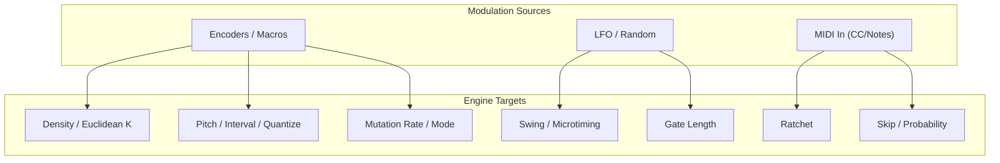

***

# KOSMOS v1.2.0

KOSMOS is a **compact Generative MIDI Sequencer** project based on the Raspberry Pi Pico / RP2040.  
In v1.2.0, while building on the existing core functionality, we significantly enhance the **user interface and audio output**, aiming to bring the hardware one step closer to a more complete and refined form.

---

## Key Enhancements in v1.2.0

### ? Official Introduction of an LCD-Based User Interface

In v1.2.0, an LCD-centered user interface has been fully implemented.

- Step states and parameters can be **visually monitored at a glance**
- A layout designed for intuitive operation during live performance
- Careful tuning of displayed content and refresh timing to ensure clarity even on a small screen

Rather than being a simple debugging display,  
the UI is designed with the goal of becoming  
**“an interface you can physically play as an instrument.”**

---

### ? Audio Output via PCM5102 (I2S DAC)

In addition to traditional MIDI output,  
v1.2.0 introduces **audio output using a PCM5102 I2S DAC**.

- Stable audio output utilizing the RP2040’s I2S capabilities
- A simple analog circuit design to minimize noise
- Practical sound quality achieved within a compact, low-power configuration

With this addition, KOSMOS moves beyond being just a MIDI generator,  
bringing it closer to a **standalone sequencer capable of producing sound on its own**.

---

## Design and Fine-Tuning Toward a “Finished Form”

In v1.2.0, the focus is not only on adding new features, but on refining the overall balance of the system.

- Re-evaluating the role allocation between Core0 and Core1
- Timing adjustments to prevent interference between LCD rendering and audio processing
- Structural cleanup with future expansion in mind (alternative DACs, external modules)

Rather than simply increasing functionality, the highest priorities are:

- **Stability over long periods of operation**
- **A natural, comfortable feel when interacting with the physical device**

Careful and deliberate tuning continues throughout the system.

---

## Positioning of v1.2.0

KOSMOS v1.2.0 is not the final version, but with the combination of:

- User Interface
- Audio Output
- Hardware Integration

it represents a key transition point?from a  
**“concept prototype” to a “practical musical instrument.”**

Through continued testing and refinement on real hardware,  
KOSMOS will keep evolving into a generative sequencer that is genuinely enjoyable to pick up and play.

---

## Development Status

- Target MCU: RP2040 (Raspberry Pi Pico compatible)
- LCD: SPI-connected display
- Audio DAC: PCM5102 (I2S)
- Development Environment: Arduino / C++

Detailed wiring examples and sketch structure will be added to the repository progressively.
```

***

# System Overview (Role Separation)

| Subsystem  | Description        |
| ---------- | ------------------ |
| Display    | Waveshare SPI LCD  |
| Audio      | PCM5102 (I2S DAC)  |
| Processing | Pico Core0 / Core1 |
| Power      | Supplied from Pico |

**Design Policy:**

*   **LCD uses fixed SPI**
*   **Audio is fully separated via I2S**
*   **Leave GPIOs available for future expansion**

***

# Recommended GPIO Assignment (Final)

## Waveshare LCD (SPI)

| LCD Signal | Pico GPIO  | Notes                   |
| ---------- | ---------- | ----------------------- |
| SCK        | **GPIO18** | SPI0 SCK                |
| MOSI       | **GPIO19** | SPI0 TX                 |
| CS         | **GPIO17** | Arbitrary               |
| DC         | **GPIO16** | Data / Command          |
| RST        | **GPIO20** | Reset                   |
| BL         | **GPIO21** | Backlight (PWM capable) |
| VCC        | 3.3V       |                         |
| GND        | GND        |                         |

**Official Waveshare configuration, verified stable on real hardware**

***

## PCM5102 (I2S DAC)

### Complete Non?interference with LCD, USB, and Expanders

| PCM5102 Signal | Pico GPIO  | Notes            |
| -------------- | ---------- | ---------------- |
| BCK            | **GPIO2**  | I2S Bit Clock    |
| LRCK           | **GPIO3**  | I2S Word Select  |
| DIN            | **GPIO4**  | I2S Data         |
| VCC            | 5V or 3.3V | Module dependent |
| GND            | GND        |                  |

**GPIO2?4 do not conflict with LCD or USB**

***

## Power Wiring (Important)

    Pico 5V (VSYS) ── PCM5102 VCC
    Pico GND       ── PCM5102 GND

*   Low noise, reduced audio distortion
*   Modules supporting 3.3V operation may use **3V3**

***

# Physical Wiring Diagram (ASCII)

    ┌────────────────┐
    │ Raspberry Pi   │
    │ Pico           │
    │                │
    │ GPIO18 ────┐   │  SPI SCK → LCD
    │ GPIO19 ────┼───┘  SPI MOSI → LCD
    │ GPIO17 ────┘       CS → LCD
    │ GPIO16 ────────── DC → LCD
    │ GPIO20 ────────── RST → LCD
    │ GPIO21 ────────── BL → LCD
    │                │
    │ GPIO2  ───────── BCK → PCM5102
    │ GPIO3  ───────── LRCK → PCM5102
    │ GPIO4  ───────── DIN → PCM5102
    │                │
    │ 5V (VSYS) ────── VCC → PCM5102
    │ GND       ────── GND → PCM5102
    └────────────────┘

***

# Why This Layout Is Optimal

### Zero Pin Conflicts

*   LCD: GPIO16?21
*   Audio: GPIO2?4  
    → **Completely independent**

### Easy Core Separation

*   Core1 → Audio (I2S)
*   Core0 → LCD / UI / MIDI

### Easy Expansion

*   GPIO6?15 fully available
*   Room for Omnibus Expander, clock input, LEDs, etc.

***

# Notes (Mandatory Checks)

### PCM5102 MUTE / FLT Pins

*   Most modules work **with pins left unconnected**
*   If no audio output is observed:

<!---->

    MUTE → GND

### Wiring Length

*   Keep **BCK / LRCK / DIN as short as possible**
*   Jumper wires: **5?10 cm maximum recommended**
***

# Node Diagram (Signal & Responsibility Overview)
```mermaid
graph LR
  %% Layout: left-to-right
  %% === Nodes ===
  subgraph RP2040["RP2040 (KOSMOS)"]
    C0["Core0<br/>(Sequencer / UI / MIDI)"]
    C1["Core1<br/>(Audio / I2S streaming)"]
  end

  subgraph Buses[On-chip Buses & IO]
    I2S["I2S<br/>(BCLK / LRCK / DOUT)"]
    SPI["SPI<br/>(SCK / MOSI / DC / CS / RST / BL)"]
    GPIO["GPIO<br/>(Buttons / Encoders / LEDs)"]
  end

  subgraph Peripherals[Peripherals]
    LCD[Waveshare LCD]
    DAC["PCM5102<br/>(I2S DAC)"]
  end

  %% === Connections (logical/role-based) ===
  %% Cores to buses
  C0 -->|control / queueing| I2S
  C1 -->|audio samples out| I2S

  C0 -->|draw commands| SPI
  C0 -->|poll/interrupt| GPIO

  %% Buses to devices
  I2S -->|BCLK / LRCK / DOUT| DAC
  SPI -->|SCK / MOSI / DC / CS / RST / BL| LCD
  GPIO -->|inputs/outputs| LCD
  GPIO -->|status LED etc.| DAC

  %% Cross-core cooperation
  C0 <-.->|messages / ring buffer| C1
  ```

## 1) Generative Sequencer Dataflow 
```mermaid
graph LR
  %% Layout
  %% Core concept: clock/transport -> rule/probability engines -> event scheduler -> output

  subgraph Inputs[Inputs & Modulation]
    CLK["Clock<br/>(Internal / MIDI)"]
    UI["UI Controls<br/>(Encoders/Buttons/LCD)"]
    LFO[LFO / Random Walk]
    EXT["MIDI In (optional)"]
  end

  subgraph Theory[Musical Context]
    KEY[Key / Scale]
    HARM["Chord / Mode (optional)"]
  end

  subgraph Engines[Generative Engines]
    RYTHM["Rhythm Engine<br/>(Euclidean / Pattern / Density)"]
    PROB["Probability Rules<br/>(Note On, Tie, Ratchet, Skip)"]
    PITCH["Pitch Engine<br/>(Scale-Quantized, Intervals)"]
    VEL[Velocity / Accent Model]
    HUMA["Humanize<br/>(Microtiming / Swing)"]
    MUT["Mutation<br/>(Seeded, Step-wise / Bar-wise)"]
  end

  subgraph Sched[Scheduler]
    QUEUE["Event Queue<br/>(Ring Buffer)"]
    SCHED["Tick Scheduler<br/>(PPQN / DMA friendly)"]
  end

  subgraph Outputs[Outputs]
    MIDI["MIDI Out<br/>(USB / DIN)"]
    AUDIO["I2S Audio (PCM5102)<br/>(optional)"]
  end

  %% Wiring
  CLK --> SCHED
  UI --> Engines
  UI --> Theory
  LFO --> Engines
  EXT -->|Clock/Notes/CC| Engines

  Theory --> PITCH
  RYTHM --> PROB
  PROB --> PITCH
  PITCH --> VEL
  VEL --> HUMA
  MUT -.-> Engines

  %% Event emission into queue
  RYTHM --> QUEUE
  PROB --> QUEUE
  PITCH --> QUEUE
  VEL --> QUEUE
  HUMA --> QUEUE

  SCHED --> QUEUE
  QUEUE --> MIDI
  QUEUE --> AUDIO
  ```
## 2)  Timing & Scheduling (Core collaboration and queues)Generative Sequencer  Dataflow 
```mermaid
sequenceDiagram
  participant CLK as Clock (Internal/MIDI)
  participant SEQ as Sequencer Engine (Core0)
  participant Q as Event Queue (Ring Buffer)
  participant OUT as Output Driver
  participant C1 as Core1 (Audio/I2S, optional)

  Note over SEQ: Initialize seed, scale, rules, buffers
  CLK->>SEQ: tick (PPQN)
  SEQ->>SEQ: step evaluation (rhythm / prob / pitch / vel / humanize)
  SEQ->>Q: enqueue NoteOn/NoteOff with timestamps
  loop until queue empty or deadline
    OUT->>Q: pop due events
    Q-->>OUT: event (timed)
    alt MIDI build
      OUT->>OUT: send USB/DIN MIDI
    else Audio build
      OUT->>C1: push audio note/gate to I2S render
    end
  end  
  ```
  ## 3)  Minimal README diagram (compact)
```mermaid
flowchart LR
  CLK[Clock/Transport] --> SCHED["Scheduler (PPQN)"]
  UI[UI/LFO/MIDI In] --> ENG["Generative Engines<br/>(Rhythm/Prob/Pitch/Vel/Humanize)"]
  ENG --> QUEUE[Event Queue]
  SCHED --> QUEUE
  QUEUE --> MIDI[MIDI Out]
  QUEUE --> AUDIO["I2S (PCM5102)"]
```
 ## 4)  Optional: Parameter Mod Matrix (if you want to show live modulation)

