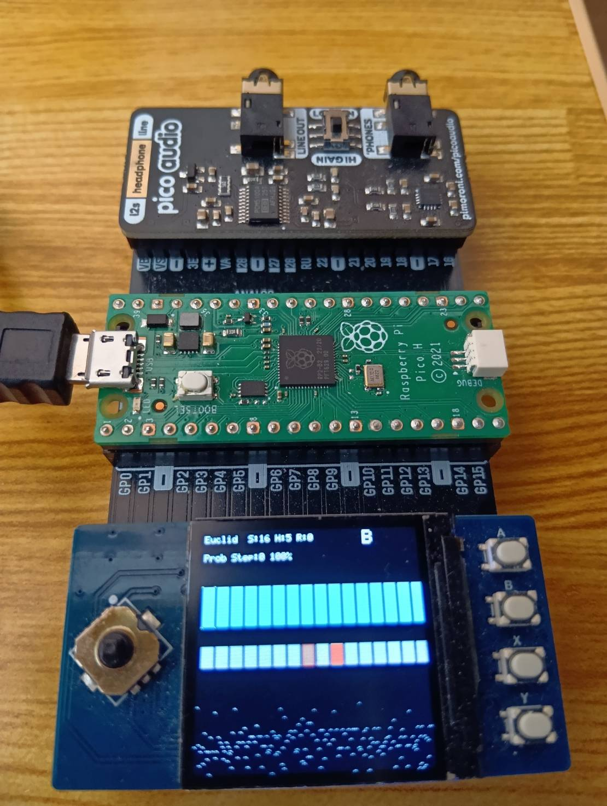

KOSMOS  Generative MIDI Sequencer for RP2040

KOSMOS is a compact generative MIDI sequencer running on the RP2040.
This project includes software, hardware design files, and presets.

License Overview

This project uses multiple licenses depending on the content type.

1. **Software (Code)  MIT License**
- Free to use, modify, redistribute, and integrate into commercial or closed-source projects.
- Only requirement: keep copyright + MIT license notice.

 `LICENSES/LICENSE-CODE-MIT.txt`

---

2. **Hardware (Schematics / PCB)  CERN-OHL-S**
- You may use, manufacture, modify, and sell hardware based on the design.
- If you distribute modified hardware, **you must publish the source** under the same license.

 `LICENSES/LICENSE-HARDWARE-CERN-OHL-S.txt`

---

3. **Presets (Patterns / Patches)  CC BY 4.0**
- Free to use, modify, redistribute, and use in creative works.
- Requirement: attribution (credit).

 `LICENSES/LICENSE-PRESETS-CC-BY-4.0.txt`

---

Author
Sugimoto
