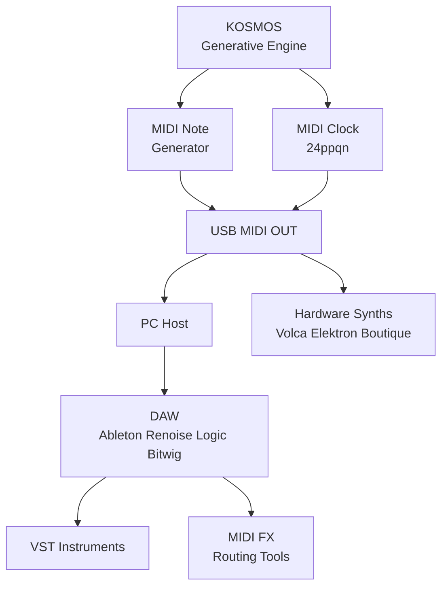

# KOSMOS v1.3.3 – Complete Generative Instrument  
**Now outputs MIDI Notes + MIDI Clock. Controls any DAW/VST in real time.**

KOSMOS has reached a new milestone.  
With **v1.3.3**, it finally implements **MIDI Note Out**, allowing the generative engine to directly control **VST instruments, hardware synths, and any DAW** with microsecond‑accurate timing.

KOSMOS is no longer just a sequencer.  
It is now a **fully independent generative instrument**.

---

## 📸 **KOSMOS Generative Instrument**

---

## 🎬 **Demo Video (MIDI Note Out)**

---

## ✨ New in v1.3.3

### **✔ MIDI Note Out (NEW)**
- Sends stable NoteOn / NoteOff messages  
- Drives VST instruments in Ableton, Renoise, Logic, Bitwig, etc.  
- Works with hardware synths via USB‑MIDI  
- Timing is microsecond‑accurate and independent of UI load  

### **✔ Ultra‑Stable MIDI Sync Out (24ppqn)**
- microsecond‑precision clock  
- Verified stable with Renoise, Ableton Live, Volca, Elektron  
- UI rendering no longer affects clock timing  

### **✔ Transport Control**
- **A+B → Start (0xFA)**  
- **A+B → Stop (0xFC)**  
- BPM color indicates state  
  - Green = Idle  
  - White = Playing  
  - Red = Stopped  

---

## 🎵 What KOSMOS Is  
KOSMOS is a compact generative MIDI instrument built on the RP2040.  
It creates **smooth, deep, rotating musical passages** with a unique blend of  
**跳ねる (jumping)** and **滑らか (smooth)** expressive motion.

Designed as an **art instrument**, not a mass‑produced device.

---

## 🧩 System Architecture (Mermaid Diagram)

```mermaid
flowchart TD
    A[KOSMOS\nGenerative Engine] --> B[MIDI Note\nGenerator]
    A --> C[MIDI Clock\n24ppqn]
    B --> D[USB MIDI OUT]
    C --> D
    D --> E[PC Host]
    E --> F[DAW\nAbleton Renoise Logic Bitwig]
    F --> G[VST Instruments]
    F --> H[MIDI FX\nRouting Tools]
    D --> I[Hardware Synths\nVolca Elektron Boutique]

```
---

## **Special Thanks**
- MATRIXSYNTH
- Powerd by ISGK Instruments PRA32-U
---
