# KOSMOS v1.3.0

KOSMOS is a compact generative MIDI sequencer designed to run on the RP2040 microcontroller.
Version **v1.3.0** introduces a hardware-focused update with full support for the **Waveshare Pico-Audio** board, including a simple and expressive button-based control interface.

This update makes KOSMOS more playable and suitable for standalone performance and experimentation.

---

## Hardware Support

### Waveshare Pico-Audio

KOSMOS v1.3.0 is optimized for use with the **Waveshare Pico-Audio** board.

The Pico-Audio provides:
- RP2040-compatible audio and GPIO layout
- Dedicated physical buttons (A / B / X / Y)
- A compact form factor suitable for embedded musical devices

All button inputs are now directly mapped to musical and performance-related functions inside KOSMOS.

---

## Button Interface

KOSMOS uses the four physical buttons on the Waveshare Pico-Audio as real-time performance controls.

### Button Assignments

| Button | Function |
|------|---------|
| **A** | Program Change for **MIDI Channel 1** |
| **B** | Program Change for **MIDI Channel 2** |
| **X** | **Tempo Change** |
| **Y** | **Pattern Change** |

---

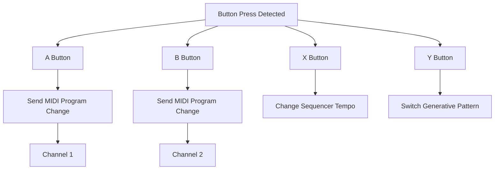
```mermaid
flowchart TD
    Start["Button Press Detected"]

    Start --> A["A Button"]
    Start --> B["B Button"]
    Start --> X["X Button"]
    Start --> Y["Y Button"]

    A --> A1["Send MIDI Program Change"]
    A1 --> A2["Channel 1"]

    B --> B1["Send MIDI Program Change"]
    B1 --> B2["Channel 2"]

    X --> X1["Change Sequencer Tempo"]

    Y --> Y1["Switch Generative Pattern"]
```
---

### Detailed Behavior

#### A Button ? Channel 1 Program Change
Pressing the **A button** sends a MIDI Program Change message on **Channel 1**.
Each press cycles through available programs in sequence.

#### B Button ? Channel 2 Program Change
Pressing the **B button** sends a MIDI Program Change message on **Channel 2**.
This allows independent sound changes for layered or multi-timbral setups.

#### X Button ? Tempo Change
Pressing the **X button** changes the global tempo of the sequencer.
This enables quick variation of groove and rhythmic feel during playback.

#### Y Button ? Pattern Change
Pressing the **Y button** switches to a different generative pattern.
Patterns define note density, rhythmic structure, and generative behavior.

---

## Use Case

With this button mapping, KOSMOS can be used as:
- A hands-on generative MIDI instrument
- A compact live performance sequencer
- A standalone algorithmic composition tool

All core musical parameters can be adjusted without a computer or external controller.

---

## System Flow
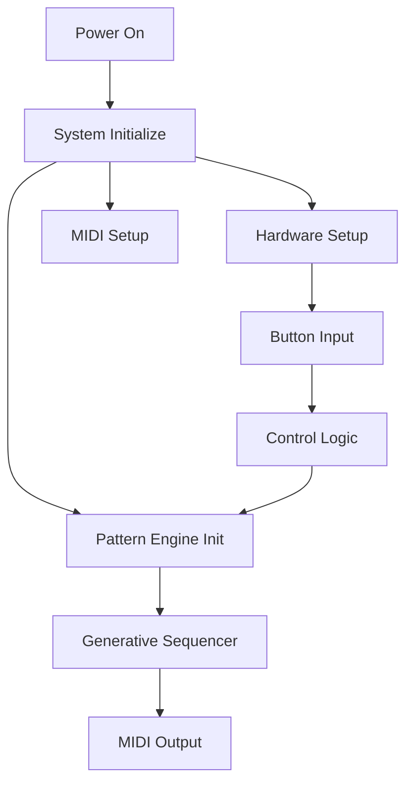
```mermaid
flowchart TD
    PowerOn[Power On] --> Init[System Initialize]

    Init --> HW[Hardware Setup]
    Init --> MIDI[MIDI Setup]
    Init --> Pattern[Pattern Engine Init]

    HW --> Buttons[Button Input]
    Buttons --> Control[Control Logic]

    Control --> Pattern
    Pattern --> Sequencer[Generative Sequencer]

    Sequencer --> MIDIOut[MIDI Output]
```

## Main Loop
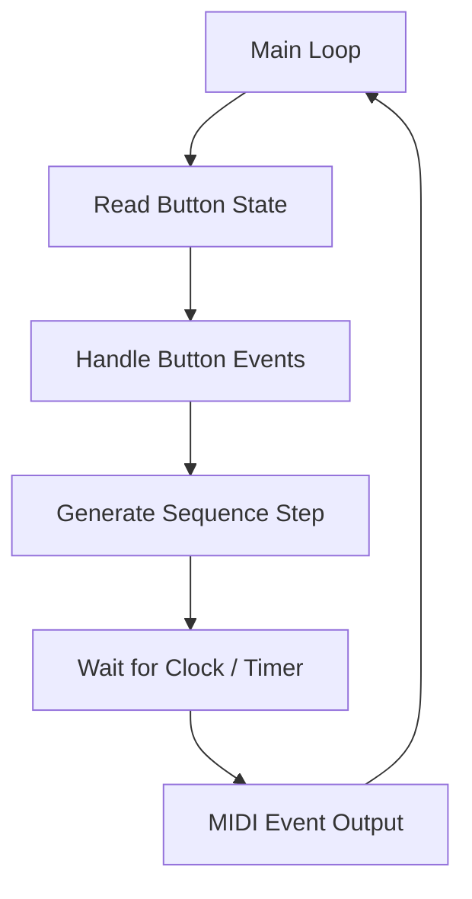
```mermaid
flowchart TD
    LoopStart[Main Loop]

    LoopStart --> ReadBtn[Read Button State]
    ReadBtn --> HandleBtn[Handle Button Events]

    HandleBtn --> GenStep[Generate Sequence Step]
    GenStep --> Clock[Wait for Clock / Timer]

    Clock --> MIDIEvent[MIDI Event Output]
    MIDIEvent --> LoopStart
```

## Button Interface
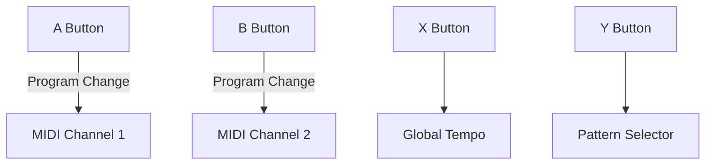
```mermaid
flowchart TD
    A[A Button] -->|Program Change| CH1[MIDI Channel 1]
    B[B Button] -->|Program Change| CH2[MIDI Channel 2]
    X[X Button] --> TEMPO[Global Tempo]
    Y[Y Button] --> PATTERN[Pattern Selector]
```

##  MIDI Out Flow
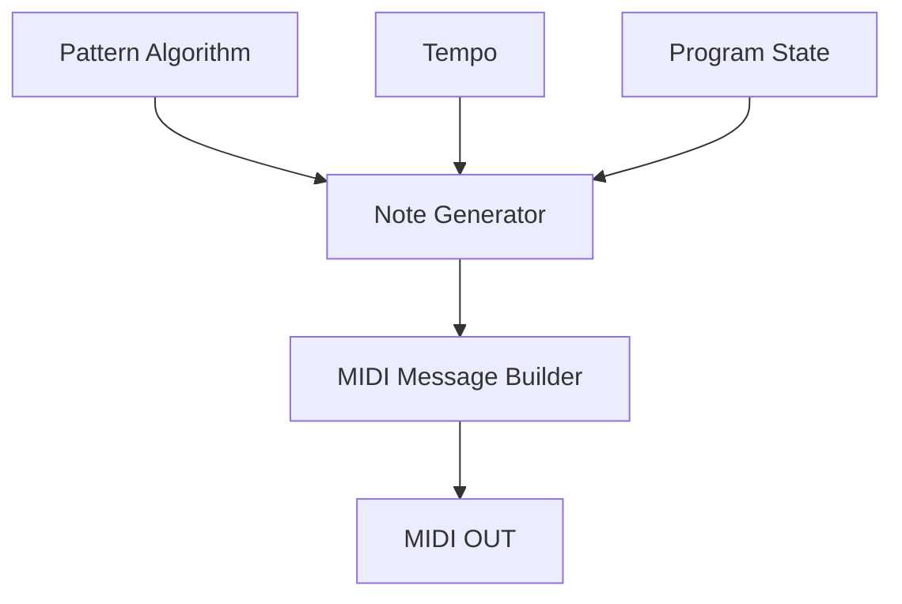
```mermaid
flowchart TD
    Pattern[Pattern Algorithm]
    Tempo[Tempo]
    Program[Program State]

    Pattern --> NoteGen[Note Generator]
    Tempo --> NoteGen
    Program --> NoteGen

    NoteGen --> MIDI[MIDI Message Builder]
    MIDI --> MIDIOut[MIDI OUT]
```

## Algorithm Flow
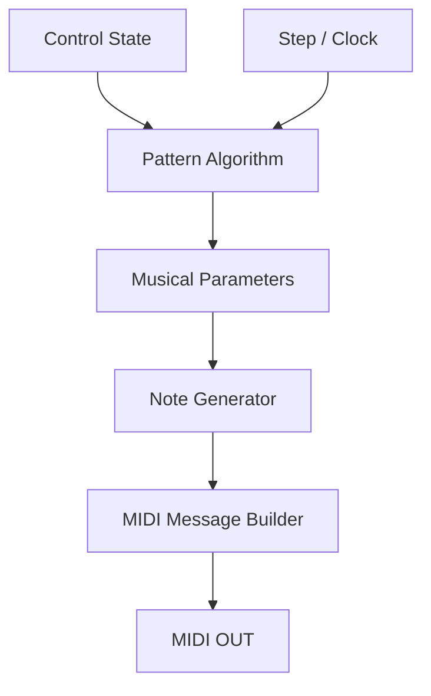
```mermaid
flowchart TD
    Control[Control State]
    Pattern[Pattern Algorithm]
    Timeline[Step / Clock]

    Control --> Pattern
    Timeline --> Pattern

    Pattern --> Params[Musical Parameters]
    Params --> NoteGen[Note Generator]

    NoteGen --> MIDIBuilder[MIDI Message Builder]
    MIDIBuilder --> MIDIOut[MIDI OUT]
```

## Control Layer
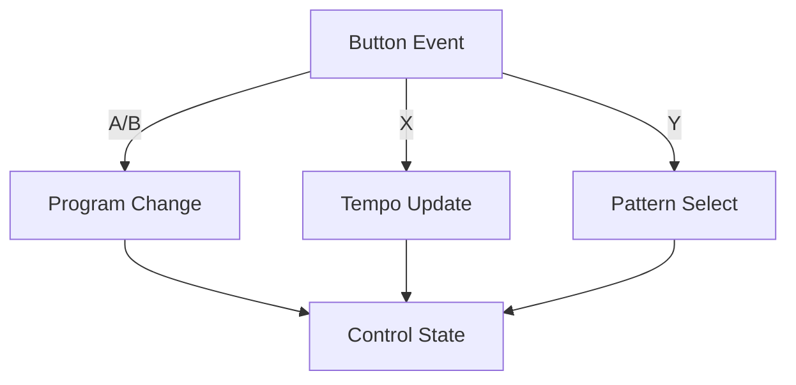
```mermaid
flowchart TD
    Button[Button Event]
    Control[Control State]

    Button -->|A/B| Program[Program Change]
    Button -->|X| Tempo[Tempo Update]
    Button -->|Y| PatternSel[Pattern Select]

    Program --> Control
    Tempo --> Control
    PatternSel --> Control
```

## Generation Layer
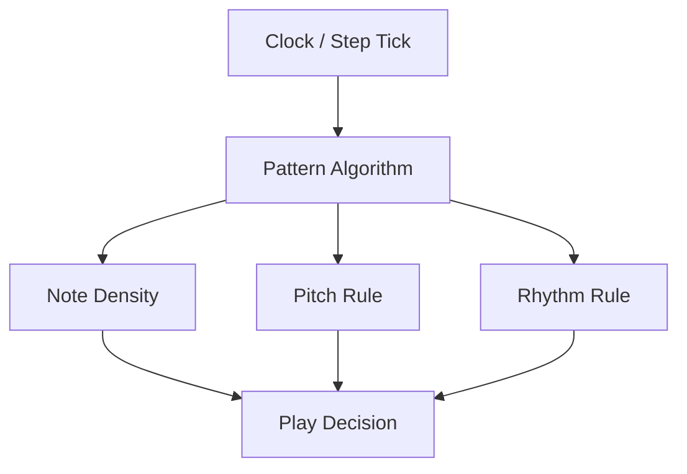
```mermaid
flowchart TD
    Clock[Clock / Step Tick] --> Pattern[Pattern Algorithm]

    Pattern --> Density[Note Density]
    Pattern --> PitchRule[Pitch Rule]
    Pattern --> RhythmRule[Rhythm Rule]

    Density --> Decision[Play Decision]
    PitchRule --> Decision
    RhythmRule --> Decision
```

## Note Generator
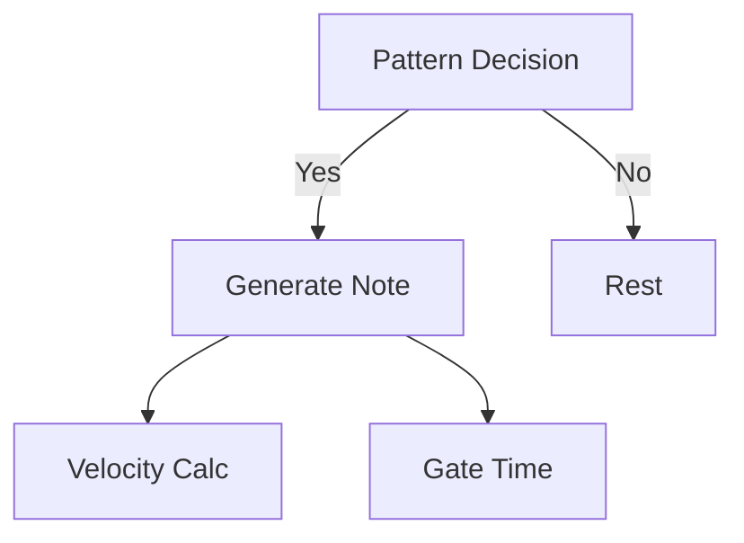
```mermaid
flowchart TD
    Decision[Pattern Decision]

    Decision -->|Yes| Note[Generate Note]
    Decision -->|No| Rest[Rest]

    Note --> Velocity[Velocity Calc]
    Note --> Duration[Gate Time]
```

## MIDI Builder
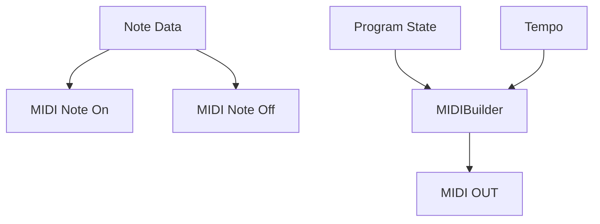
```mermaid
flowchart TD
    Note[Note Data]

    Note --> NoteOn[MIDI Note On]
    Note --> NoteOff[MIDI Note Off]

    Program[Program State] --> MIDIBuilder
    Tempo[Tempo] --> MIDIBuilder

    MIDIBuilder --> MIDIOut[MIDI OUT]
```

## Inner Flow
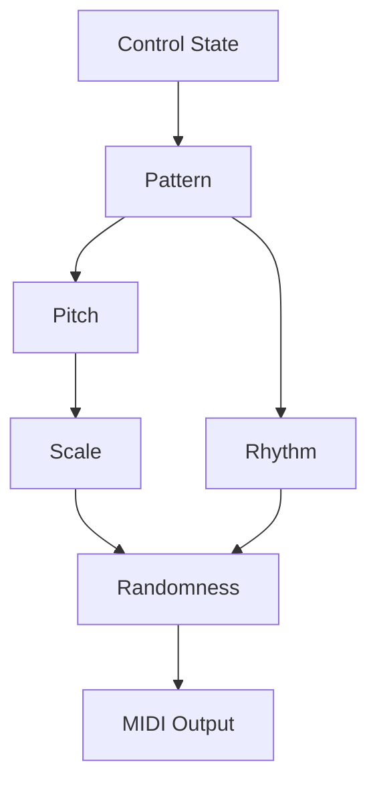
```mermaid
flowchart TD
    Control[Control State]

    Control --> Pattern
    Pattern --> Pitch
    Pattern --> Rhythm

    Pitch --> Scale
    Scale --> Randomness

    Rhythm --> Randomness

    Randomness --> MIDI[MIDI Output]
```

---

## Version History

### v1.3.0
- Added Waveshare Pico-Audio support
- Implemented full button interface
- Program Change control for MIDI Channels 1 and 2
- Real-time tempo and pattern switching

---

## License

MIT License.

---

## Special Thanks

  Powerd by ISGK Instruments PRA32-U.
