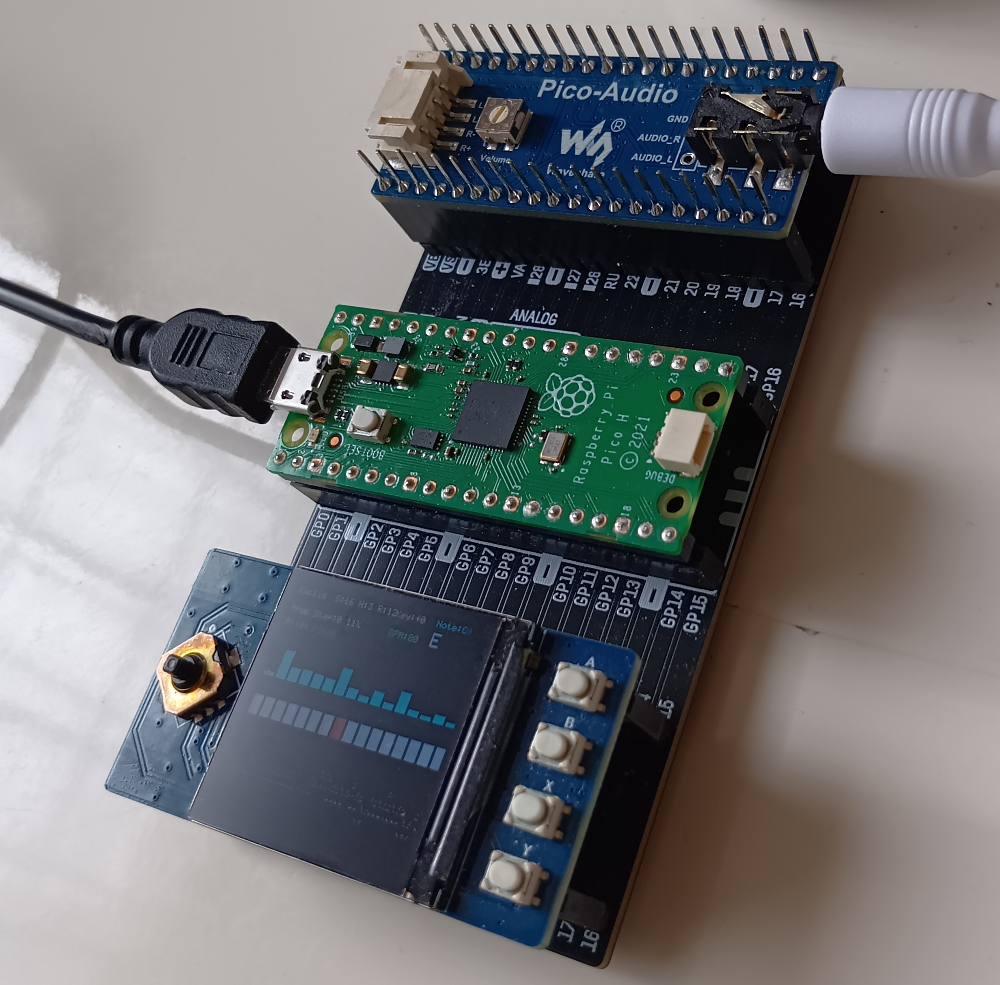

# **KOSMOS v1.3.2 – Ultra‑Stable MIDI Sync & Refined UI**

## ✨ **New Features**
- Added **MIDI Sync Out (24ppqn)**  
  - Ultra‑stable clock powered by `micros()`  
  - Compatible with Renoise, Ableton, Volca, Elektron, and other hardware/software

- Added **Start/Stop control (A+B simultaneous press)**  
  - Start → MIDI `0xFA`  
  - Stop → MIDI `0xFC`  
  - Playback state is visualized through BPM text color  
    - **Green** = Idle  
    - **White** = Playing  
    - **Red** = Stopped

## 🎨 **UI Improvements**
- BPM is now always displayed  
- BPM text color changes based on Start/Stop state  
- Removed long‑press program switching (prevents accidental changes)

## 🎵 **Stability**
- Greatly reduced MIDI Clock jitter (now using `micros()` timing)  
- Improved synchronization stability with Renoise  
- Clock output is no longer affected by UI rendering load

## 🛠 **Fixes**
- Improved NoteOff timing stability  
- Removed unused or redundant code  
- Cleaned up A/B program switching behavior

## **Special Thanks**
- MATRIXSYNTH
- Powerd by ISGK Instruments PRA32-U
